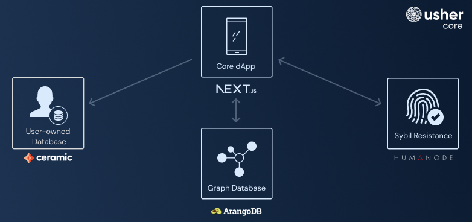

<div align="center">
  <h1>Usher Web3 Referrals</h1>
	<div>
		<span>
			<a href="https://www.npmjs.com/package/prisma"></a>
		</span>
		<span>
			<a href="https://www.gnu.org/licenses/gpl-3.0"></a>
		</span>
	</div>
</div>

<div align="center">
   <a href="https://www.usher.so/referrals?ref=github">Website</a>
   <span> | </span>
   <a href="https://usherlabs.github.io/usher-referrals/?ref=github">Documentation</a>
   <span> | </span>
   <a href="https://go.usher.so/discord">Discord</a>
   <span> | </span>
   <a href="https://go.usher.so/twitter">Twitter</a>
</div>

## 👋 Introduction

Open Source Web3 integrated Referrals Platform that enables Brands to grow through performance-based marketing.

Deploy the platform to start a Partner, Affiliate, Ambassador, or Reseller Program.

### Screenshots


### For Brands

1. Create a Partnership Campaign that defines conversion events and their associated incentives.
   These events are triggered within your Web App, infrastructure, and even [Smart Contracts](https://www.investopedia.com/terms/s/smart-contracts.asp).
2. Fund the Campaign to ensure partners are aware of available funds and therefore remaining incentives.
3. When a conversion event is triggered off the back of a referral, the referrer _(aka. Partner)_ accrues rewards accordingly.

#### Note on Decentralisation

Usher is being designed to interoperate with decentralised systems to yield the fairest outcomes for all participants.
Nonetheless, the user experience will remain familiar and inspired by traditional web applications we know and love - as to minimise user complexity.
The goal is to ensure **any Brand can leverage Usher** whether they're a [DeFi](https://www.investopedia.com/decentralized-finance-defi-5113835) Protocol, an [eCommerce](https://sell.amazon.com/learn/what-is-ecommerce) store, or even a Content Creator!

### For Partners

_Partners can be affiliates, ambassadors, influencers, publishers, etc._

1. Learn and understand a Campaign to know if it's suitable for your audience, community, or clients.
2. Engage the Campaign and get a shareable invite link.
3. Share your link to refer people to the Brand's service.
4. Earn rewards when referred people trigger conversion events within the Brand's service.
5. Claim your rewards

### For Operators

_An Operator is an entity or individual responsible for deploying and managing an Usher instance._
_This can be the Brand looking to offer a white-labelled partner/affiliate experience, or a third party, such as a Marketing Agency, Marketplace, or [DAO](https://www.investopedia.com/tech/what-dao/), seeking to elevate its community into evangelists._

1. Deploy the Usher Stack.
2. Invite your community to your Usher instance to seed the partner network.
3. _(Optionally)_ Yield a commission when partners claim their rewards.

#### Note on Rewards

Rewards are handled using cryptocurrency, ensuring accessibility for participants across the world.
Currently, the Operator is responsible for storing **encrypted** Wallet Private Keys within their Database.
Each Campaign has a corresponding wallet that is funded by the Brand responsible for the Campaign.
_Decentralisation of funds management coming soon..._

These rewards can be:

1. ERC20 tokens such as [USDC](https://www.coingecko.com/en/coins/usd-coin), or [ETH](https://www.coingecko.com/en/coins/ethereum)
2. ERC721 or ERC1155 NFTs
3. There's also logic to support [AR](https://www.coingecko.com/en/coins/arweave) tokens

## 🚏 Navigation

[Homepage →](https://usher.so/referrals)

[Documentation →](https://usherlabs.github.io/usher-referrals/)

[Create Campaigns & Embed Usher in your Application →](https://github.com/usherlabs/programs)

[Track Conversion Events in Web Apps with Usher.js →](https://usherlabs.github.io/usher-referrals/integrating-with-usherjs/what-is-usherjs)

## 🌟 Features

Usher Core encompasses the necessary code to run:

- An application to deliver a user-friendly front-end interface, and server-side operations
- Database migrations to ensure smooth deployment and updates
- Command-line tools for administrative support
- A Listener service that facilitates conversions based on Smart Contract events.

## 📐 Core architecture



- **Core Web App**: Usher Core's central component is a **[NextJS](https://nextjs.org/)**-based Application that provides an accessible and user-friendly interface for managing campaigns. It also ensures smooth interaction with other services by employing deployed serverless functions.
- **User-owned Database**: By leveraging **[Ceramic](https://ceramic.network/)**'s decentralized data storage network, Usher Core provides a secure and user-centric data management solution. Ceramic schemas ensure organized and consistent data storage for elements like partnerships, campaign details, and advertiser profiles while allowing users to maintain control over their data.
- **Sybil Resistance**: Employs **[Humanode](https://humanode.io/)**'s [Sybil Resistance](https://blog.humanode.io/attack-on-sybil/) and OAuth systems to maintain the integrity of user interactions within the platform, ensuring that only genuine users can participate in the ecosystem and preserving the security and trustworthiness of user accounts.
- **Graph Database**: Centralized storage using **[ArangoDB](https://arangodb.com/)**, a multi-mode graph database. It holds data about user interactions, partnerships, campaigns, and more.
- _(Optional)_ **Listener Service**: An service for listening to an EVM Blockchain and creating conversions off the back of Smart Contract events.
  - Where a Campaign is configured to include events that reference Smart Contracts, the Shareable Invite Links will request a Wallet Connection from referred users to capture their wallets and attribute them to a Partner's referrals

## 📦 Packages Overview

| Package Name                             | Description                                                                                             |
| ---------------------------------------- | ------------------------------------------------------------------------------------------------------- |
| [packages/admin](./packages/admin)       | CLI for executing administrative functions on the Usher node.                                           |
| [packages/app](./packages/app)           | Next.js app provides a user-friendly interface for managing and interacting with Usher functionalities. |
| [packages/graph](./packages/graph)       | Manages ArangoDB structure (migration files) and provides serverless utilities for scalability.         |
| [packages/listener](./packages/listener) | _Optionally_ set up a Blockchain listener to create conversions off the back of Smart Contract events.  |
| [packages/ceramic](./packages/ceramic)   | _Optionally_ set up your own Ceramic node on a Linux server.                                            |

## 🏁 Getting started

1. Ensure your system meets the requirements:

- Node.js (v14 or higher)
- Yarn (v1)
- docker-compose (v1.25.5 or higher)

1. Clone the repository:

```bash
git clone https://github.com/usherlabs/usher.git
cd usher
```

2. To install dependencies, run `pnpm install` in the root directory.

   > Usher Core is a monorepo with multiple packages in the `packages` directory. Each package has its own `package.json` and scripts. Learn more about [PNPM Workspaces](https://pnpm.io/workspaces).

3. For package overviews and instructions to start services, refer to the respective package documentation.

## **🚀** Usage and Deployment

Users can interact with your deployed Usher Core node in two ways:

- By using the frontend interface deployed by the same node
- By integrating directly with your servers, utilizing [User Programs](https://github.com/usherlabs/programs)

Deploying each of the packages requires a review of information in each of their README files.

### Setting up our Core Next.js application

[This guide provided at `packages/app`](./packages/app/README.md#how-to-run-it) will help you set up the Next.js application for Usher Core.

By following it, you will be able to:

- Run the Next.js application locally
- Deploy this application to Vercel

### Setting up ArangoDB

[This guide provided at `packages/graph`](./packages/graph/README.md#setting-up-an-arangodb-instance) will help you set up ArangoDB for Usher Core.

By following it, you will be able to:

- Set up an ArangoDB instance on ArangoDB Cloud or on-premise, even at your local machine
- Set up a database and a database user for Usher Core usage

### Setting up migrations with ArangoMiGO

[This guide provided at `packages/graph`](./packages/graph/README.md#using-arangomigo-to-manage-migrations) will help you set up ArangoMiGO to manage migrations on your ArangoDB instance.

By following it, you will be able to:

- Install Golang and necessary dependencies to run ArangoMiGO
- Install ArangoMiGO
- Run the migration files to create and update the database structure required by Usher Core

### Setting up the Listener Node _(Optional)_

[This guide provided at `packages/listener`](./packages/listener/README.md#deploy) will help you set up the Listener Node for Usher Core.

It will help you to either:

- Use the Listener Node locally
- Deploy the Listener Node using docker
- Manually deploy the Listener Node to a VPS (e.g. Ubuntu)

You may want to deploy the Listener Node if you want to track conversions on blockchain ecosystems or other smart contracts.

### Setting up a Ceramic Node _(Optional)_

By default, you can use Usher's Public Ceramic Node for Production purposes - **hosted at [https://ceramic.usher.so](https://ceramic.usher.so)**.

If you prefer to manage your own Cermaic Node for administative purposes, [the guide outlined in `packages/ceramic`](./packages/ceramic/README.md#ceramic) will help you set up a Ceramic node for Usher Core.

### During these steps you may find it helpful to:

- **[Create a Vercel account](https://vercel.com/signup)** to support the deployment of the `app` package.
- **[Set up ArangoDB Cloud or On-Premise](https://www.arangodb.com/)** to handle Usher's data. Refer to the `graph`
  package to learn more.
- **[Create a Sentry account](https://sentry.io/signup/)** to enable error tracking and monitoring for your Usher Core
  deployment. This will help you identify and resolve issues more efficiently, ensuring a smoother user experience.

But bear in mind that these are not mandatory steps. You may choose to deploy Usher Core using other preferred services as well.

## 😵‍💫 Troubleshooting

- Don’t forget to check if our [Documentation](https://docs.usher.so/) already covers you
- For questions, support, and discussions: [Join the Usher Discord →](https://go.usher.so/discord)
- For bugs and feature requests: [Create an issue on Github →](https://github.com/usherlabs/core/issues)

## 🤔 **Missing Something Important to You?**

We know that everyone has different needs, and we want Usher to be as helpful and adaptable as possible. If you think
we're missing a feature that would make a big difference for you, we're all ears!

To suggest a new feature, just head over to our **[GitHub repository](https://github.com/usherlabs/usher)** and create a
new issue. Remember to add the `suggestion` tag to your issue, so we can find and prioritize your request.

Our team is always working to enhance and grow Usher, and your input is super valuable in guiding the project's future.
By sharing your suggestions, you're helping to improve the Usher community and make the product even better for
everyone. So, if you have a cool idea, don't hesitate to let us know!

## 💚 Contributing

There are many ways you can contribute to taking Usher’s mission to empower partnerships even further.

- Open issues for bugs, typos, any kind of errors you encountered, or features you missed
- Submit pull requests for something you are able to tackle (tests are always great ways to start it out)
- Engage with our community on our [Discord server](https://go.usher.so/discord) or
  our [Twitter profile](https://twitter.com/usher_web3)
- What about writing an article and exposing it somewhere? How great would be to help people know there is Usher out
  there desiring to help them build strong communities? Spread the word!

## 🛣️ Roadmap

- [x] Partner Dashboard where Campaigns can be engaged, invite links created, and rewards can be claimed.
- [x] General Link Sharing for Wallet Connections - to simplify Community wallet collection.
- [ ] Simplify authentication to allow Operators to toggle on **Magic Auth** and/or **Sign in with Ethereum**.
- [ ] Brand Dashboard for Analytics, Partner Management and Manual Remittance.
- [ ] System Console to enable UI driven platform management.
- [ ] Enable Plugins where Operators can simply enhance their Usher instance with integrations.
- [ ] Decentralise data and funds management to simplify Operator deployments and management.

## Example Campaigns

[See Documentation](https://docs.usher.so/grow-your-brand/the-campaign-object) to learn more about the meaning of the following objects/properties.

### Default Conversion Tracking

```json
{
	// Refers to the Campaign's wallet holding funds
	"id": "QOttOj5CmOJnzBHrqaCLImXJ9RwHVbMDY0QPEmcWptQ",
	"chain": "arweave",
	"owner": "ksFTLgrwQGtNrhRz6MWyd3a4lvK1Oh-QF1HYcEeeFVk",
	"events": [
		{
			"strategy": "percentage",
			// Rewards a 50% commission per conversion.
			"rate": 0.5,
			"description": "brands submit their partnership program setup via the Usher Campaign Onboarding Form"
		},
		{
			"strategy": "flat",
			// Rewards 0.05 AR tokens per conversion
			"rate": 0.05,
			"description": "brands submit their interest for a partnership program on the Usher website"
		}
	],
	"reward": {
		"name": "Arweave",
		"ticker": "AR",
		"type": "token"
	},
	"details": {
		"destination_url": "https://go.usher.so/start-a-campaign?ref=usher_dapp",
		"name": "Usher ❤️ Arweave Reseller Program",
		"description": "Refer Web3 Brands building & growing on the Arweave Blockchain to Usher and earn up to 50% commission when Rewards are claimed from their Campaigns.",
		"image": "https://usher-pub.s3.amazonaws.com/onlyarweave-posh.png"
	},
	"advertiser": {
		"name": "Usher",
		"icon": "https://pages.usher.so/wp-content/uploads/2022/03/usher-logo-medium.png",
		"description": "Partnerships for Web3",
		"external_link": "https://usher.so",
		"twitter": "https://twitter.com/usher_web3"
	},
	// Disable Proof-of-Personhood Verification (powered by Humanode)
	"disable_verification": true,
	"whitelist": {
		// Here you can modify the campaignt to whitelist partners using their Parntership Stream ID -- ie. Invite Link ID
		"partners": [
			"kjzl6cwe1jw146p6jys6zlxhflmztj4dl7atshqglrl0k7ezbbnpmvzmsb02091"
		],
		// Set an external link that will show to partners, so that they're aware of where to be whitelisted.
		"external_link": "https://discord.gg/mDUMfhqUcH"
	},
	// The _internal property is created automatically using the @usher.so/programs Campaigns CLI.
	// The CLI tool will create a new wallet, encrypt it's private key using your Admin DID, and then store it here.
	// At partner reward claim, the
	"_internal": {
		"address": "QOttOj5CmOJnzBHrqaCLImXJ9RwHVbMDY0QPEmcWptQ",
		"key": "........"
	}
}
```

### Smart Contract Conversion Tracking

```json
{
	"id": "0x7982bEDc1D35CDc08Dd3572c0a4cc225D55a4447",
	"chain": "ethereum",
	"events": [
		{
			"strategy": "flat",
			"rate": 0.1,
			"description": "Task Created",
			"contract_address": "0xabBA944b417D1E1310a673eC410d03B02B7557F6",
			"contract_event": "TaskCreated(uint256,string,bool)"
		},
		{
			"strategy": "flat",
			"rate": 0.2,
			"description": "Task Toggled",
			"contract_address": "0xabBA944b417D1E1310a673eC410d03B02B7557F6",
			"contract_event": "TaskToggled(uint256,bool)"
		}
	],
	"reward": {
		"name": "ChainLink",
		"ticker": "LINK",
		"type": "erc20",
		"limit": 10,
		"address": "0x326C977E6efc84E512bB9C30f76E30c160eD06FB"
	},
	"conflict_strategy": "PASSTHROUGH",
	"disable_verification": true,
	"details": {
		"destination_url": "https://victorshevtsov.github.io/brand-app/",
		"name": "Usher ❤️ Ethereum Reseller Program",
		"description": "Refer Web3 Brands building & growing on the Ethereum Blockchain to Usher and earn up to 50% commission when Rewards are claimed from their Campaigns."
	},
	"advertiser": {
		"name": "Usher",
		"icon": "https://pages.usher.so/wp-content/uploads/2022/03/usher-logo-medium.png",
		"description": "Partnerships for Web3",
		"external_link": "https://usher.so",
		"twitter": "https://twitter.com/usher_web3"
	},
	"_internal": {
		"address": "0x7982bEDc1D35CDc08Dd3572c0a4cc225D55a4447",
		"key": "........"
	}
}
```

## 📜 License

Copyright (c) 2022 Usher Labs Pty Ltd & Ryan Soury

This program is free software: you can redistribute it and/or modify it under the terms of the GNU Affero General Public License as published by the Free Software Foundation, either version 3 of the License, or (at your option) any later version.

This program is distributed in the hope that it will be useful, but WITHOUT ANY WARRANTY; without even the implied warranty of MERCHANTABILITY or FITNESS FOR A PARTICULAR PURPOSE. See the GNU Affero General Public License for more details.

You should have received a copy of the GNU Affero General Public License along with this program. If not, see https://www.gnu.org/licenses/agpl-3.0.

Usher is a collaborative effort, and we want to extend our gratitude to all contributors who have helped shape and improve the software.
