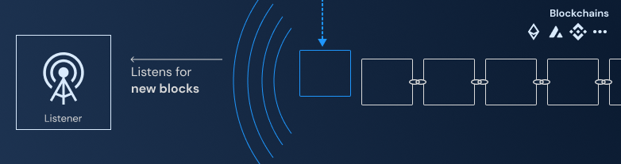
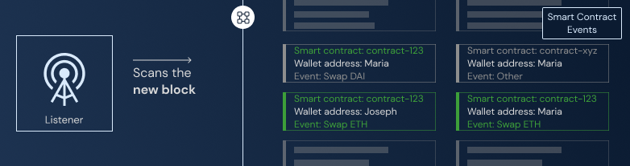
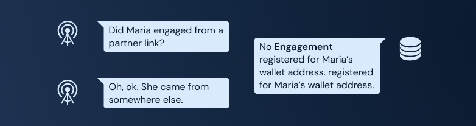
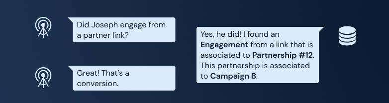

# Listener

## Introduction

This package is designed to monitor, filter, and process smart-contract-based conversion events in blockchain ecosystems. By tracking user interactions with smart contracts, Listener plays an essential role in enabling brands to reward partners for successful conversions.

## How does this work?

There are currently two kinds of conversion events in Usher. Smart contract or web-based conversions. The listener helps to build the process of smart-contract ones.

Get a quick glance at what steps the listener takes to register conversions:

### Gathering campaigns with smart contract objectives

1. We must first query our ArangoDB data for `Campaigns` that have at least one conversion based on smart contracts defined. It’s easy to distinguish between the two types as smart-contract ones have a `contractAddress` attribute defined.
2. This associated smart contract may emit several kinds of events, depending on user action. However, not all actions are considered **conversions** for this campaign.
3. So, we can say that a campaign may have many **objectives** (a.k.a. conversions). The listener, after querying our data, knows what are the objectives of the campaigns.

### Listening for new blocks propagated by blockchains

1. We employ Ethers to connect to the blockchain and listen for new blocks.
2. As new blocks are mined and propagated, Listener polls and receives block data, ready to be processed.

### Scan this new block for events of interest

1. With this new block data, we scan for events emitted by the target smart contracts.
2. For the event to be important for us, it also needs to be a conversion event. So we also filter by matching the `contractEvent` metadata.

### Filter for conversions that came from referred users

A referred user is someone who came from a Partner link. To properly compensate Partners, we should track if these new conversions came from users that were the fruit of Partner efforts.

**Checking for Maria’s engagement:**

**Checking for Joseph’s engagement:**

1. For a new conversion event registered, we extract what is the user wallet address associated with this event.
2. We query our data on ArangoDB for `Partnership`s that may have an `Engagement` registered with this wallet address. This `Partnership` also needs to be associated with one of the campaigns we have filtered previously.
3. If the result of this last query is not empty, then we successfully found a new conversion from a referred user.

### Registering results

1. We register this conversion by updating our data on ArangoDB, creating a `Conversion`.

## How to read it?

### File structure

- `core`: The core logic for event handling and block polling.
  - `EventFetcher.ts`: Handles fetching contract events.
  - `Objective.ts`: Represents a contract and its associated events.
  - `EventListener.ts`: Listens for contract events and manages the event queue.
  - `ContractEvent.ts`: Defines the structure of a contract event.
  - `BlockPolling.ts`: Handles block polling and event notifications.
- `utils`: Utility modules for various functionalities.
  - `Options.ts`: Defines options for block polling.
  - `json-rpc-provider.ts`: Provides an Ethers JSON RPC provider.
  - `logger.ts`: Handles logging using the Pino library.
  - `arango-client.ts`: Provides a connection to the ArangoDB database.
- `conversion.ts`: Handles conversion-related operations for a campaign.
- `config`: Configuration settings for the application.
  - `index.ts`: Exports configuration settings from environment variables.
- `types.ts`: Defines various enums and types related to the application.
- `main.ts`: The main logic to start the application and handle events.
- `errors`: Custom error classes.
  - `CustomError.ts`: A base class for custom errors.
  - `BlockNotFoundError.ts`: An error class for block not found errors.

## How to run it?

### Environment setup

| Environment Variable | Description                                                                            | Default Value |
| -------------------- | -------------------------------------------------------------------------------------- | ------------- |
| ARANGO_URL           | URL of the ArangoDB instance                                                           |               |
| ARANGO_DATABASE      | Name of the ArangoDB database                                                          |               |
| ARANGO_USERNAME      | Username for connecting to the ArangoDB instance                                       |               |
| ARANGO_PASSWORD      | Password for connecting to the ArangoDB instance                                       |               |
| PROVIDER_URL         | Ethereum JSON-RPC provider URL                                                         |               |
| START_BLOCK          | Starting block number for the Listener to process                                      |               |
| LOG_LEVEL            | https://github.com/pinojs/pino/blob/master/docs/api.md#loggerlevel-string-gettersetter | debug         |

These variables should be set before running the application in order to configure the connection to ArangoDB, Ethereum, and logging preferences.

### Locally

To run Listener locally, follow these steps:

1. Ensure you have followed this monorepo root’s installation guide.
2. Navigate to this package folder and execute `pnpm dev` to start the Listener.

### Deploy

For deployment, you can utilize popular cloud services providers such as AWS, Azure, or GCP. We will guide you through two deployment methods for the Listener package: Docker and manual deployment on a virtual private server (VPS). Any other deployment method compatible with this structure may be utilized. Please file an issue on this repository if you would like to see a different kind of deployment method that creates friction for you.

**Docker Deployment**

The Listener package includes a `docker-compose.yml` file, which simplifies the deployment process using Docker. Here's a quick guide to deploying Listener with Docker:

1. Make sure you have Docker and Docker Compose installed on your system.
2. Set up the required environment variables for the Listener package, as defined in the `docker-compose.yml` file.
3. Run `docker-compose up -d` in the directory containing the `docker-compose.yml` file to start the Listener container in the background.

**Manual Deployment on a VPS (e.g., Ubuntu)**

To deploy Listener on a VPS, follow these steps:

1. Set up a VPS with your preferred provider, such as AWS EC2, DigitalOcean, or Linode.
2. Install Node.js and other dependencies listed on the root of this repository.
3. Clone this repository onto the VPS.
4. Set the necessary environment variables, as specified in the `docker-compose.yml` file.
5. Run the instructions provided at the root of this repository to install dependencies.
6. Navigate to this package folder and run `pnpm build` to create an optimized package of source files using ESBuild.
7. Start the Listener by running `node ./build/main.js`.

Once the Listener is up and running, you can monitor and manage the deployment as needed.

## What’s next?

[View other packages →](../)

[Go to Usher main documentation →](https://docs.usher.so/)
